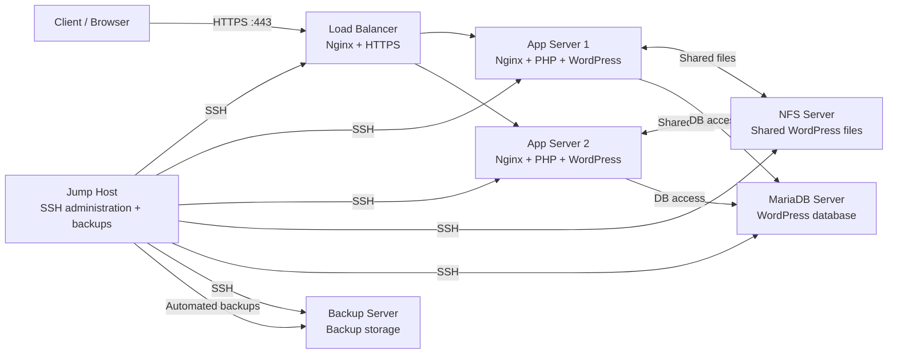

# 🐧 Linux Infrastructure Lab — Full Production-Like Environment

A hands-on Linux infrastructure project built locally with **Multipass VMs**, based on the *Become A Linux Hero* lab.

The project combines Linux system administration, SSH hardening, Nginx, Node.js, Python, MariaDB, NFS, load balancing, backups, cron scheduling, firewalling, WordPress, and a Jump Host into a single production-like environment.

> **Note:** This repository documents the lab requirements and provides the structure for my own implementation, commands, configurations, validation results, and screenshots. Sensitive values such as passwords, private keys, and certificates should never be committed.

## 🎯 Project Goals

- Build and manage a multi-server Linux infrastructure without cloud costs.
- Practice secure administrative access through a **Jump Host**.
- Deploy a WordPress application across **two App Servers**.
- Use **NFS** for shared WordPress storage.
- Use **MariaDB** as a centralized database layer.
- Use **Nginx** as an HTTPS reverse proxy / load balancer.
- Automate server backups with **Bash + SSH + cron**.
- Apply basic host-level security using **IPTables** and SSH hardening.
- Validate connectivity, failover, storage, database access, and backup behavior.

The lab explicitly uses Multipass to build the infrastructure locally and includes SSH hardening, firewall rules, centralized administration through a Jump Host, application servers, a database, NFS storage, load balancing, and automated backups. fileciteturn0file0L193-L213

---

## 🏗️ Architecture



### Server Roles

| Server | Main Role |
|---|---|
| Load Balancer | Nginx, HTTPS termination, traffic distribution |
| App Server 1 | Nginx + PHP + WordPress |
| App Server 2 | Nginx + PHP + WordPress |
| NFS Server | Shared `/var/www/wordpress/` storage |
| Database Server | MariaDB |
| Jump Host | Administrative access and backup automation |
| Backup Server | Central backup storage |

The final project specification defines separate roles for the NFS server, MariaDB server, two application servers, load balancer, Jump Host, and Backup Server. fileciteturn0file0L215-L235

---

## 🔐 Security Model

The infrastructure is designed around restricted administrative access:

- Root login disabled.
- SSH key authentication instead of password authentication.
- Non-default SSH port.
- Administrative access through the Jump Host.
- IPTables rules on the servers.
- Database access restricted to the App Server network.
- App Servers accept web traffic only from the Load Balancer.
- Sensitive database credentials stored in protected files (`chmod 600`).
- Backup Server accepts backup data only from the Jump Host.

These security controls follow the final-project requirements in the lab specification. fileciteturn0file0L203-L212 fileciteturn0file0L226-L235

---

# 📚 Lab Challenges

The lab is structured as ten progressive challenges, followed by the full infrastructure project. fileciteturn0file0L11-L44

| # | Challenge | Main Skills |
|---|---|---|
| 1 | Web Basics | Nginx, HTML, HTTPS, self-signed TLS |
| 2 | Virtualization & SSH | Multipass, SSH keys, SSH hardening |
| 3 | Jump Host & SSH Config | Bastion access, `~/.ssh/config` |
| 4 | Application Deployments | Node.js, Python, remote deployment |
| 5 | Backup & Scheduling | Bash, compression, SSH, cron |
| 6 | Database Management | MariaDB, dump, restore |
| 7 | Shared Storage | NFS |
| 8 | Load Balancing | Nginx, multiple backends |
| 9 | WordPress Deployment | Nginx, PHP, WordPress, LEMP |
| 10 | Security Practice | IPTables, connectivity validation |

The individual challenge objectives are taken directly from the lab document. fileciteturn0file0L87-L187

---

# 🚀 Final Project

The final project combines the previous concepts into a single Linux infrastructure.

## 1. All Servers

- SSH hardening
- Admin and Dev groups
- Sudo privileges for the required administrative tasks
- IPTables firewall
- Access restricted through the Jump Host
- Root login disabled
- Regular updates
- Centralized logging

## 2. NFS Server

Shared WordPress directory:

```text
/var/www/wordpress/
```

Only the App Servers should be allowed to access the exported share.

## 3. Database Server

MariaDB runs on its own VM with:

- dedicated WordPress database
- dedicated WordPress user
- restricted network access
- access limited to the App Server network

## 4. App Servers

Both App Servers run:

```text
Nginx
PHP
WordPress
NFS-mounted shared files
```

Each server connects to the central MariaDB server.

## 5. Load Balancer

Nginx distributes traffic between the two App Servers.

Required public ports:

```text
80   -> HTTP
443  -> HTTPS
6546 -> SSH
```

The lab also requires a self-signed certificate and real-time traffic observation through the Nginx access log. fileciteturn0file0L237-L247

## 6. Jump Host

The Jump Host is the administrative entry point for the infrastructure.

It handles:

- SSH access
- SSH key management
- `~/.ssh/config`
- access auditing
- scheduled backups

The specification requires the backup job to run daily at 12 PM. fileciteturn0file0L248-L258

## 7. Backup Automation

The backup workflow:

```text
Remote Server
     ↓
Check disk space
     ↓
Create compressed archive
     ↓
Copy to Jump Host
     ↓
Push to Backup Server
     ↓
Retain previous 3 days
     ↓
Delete older backups
     ↓
Write logs
```

This follows the backup requirements defined by the lab. fileciteturn0file0L260-L270

## 8. Backup Server

Backups are organized by:

```text
backup-server/
├── server-1/
│   └── YYYY-MM-DD/
├── server-2/
│   └── YYYY-MM-DD/
└── ...
```

Only the Jump Host should be allowed to send backups to this server. fileciteturn0file0L271-L276

---

# ✅ Validation Checklist

The final infrastructure should be validated against the following:

- [ ] Firewall rules are active and correct.
- [ ] SSH is accessible only through the Jump Host.
- [ ] HTTPS works on the Load Balancer.
- [ ] App Server 1 can access the NFS share.
- [ ] App Server 2 can access the NFS share.
- [ ] App Servers can reach MariaDB.
- [ ] Other hosts cannot directly access MariaDB.
- [ ] Backups are stored successfully on the Backup Server.
- [ ] Load Balancer distributes traffic between both App Servers.
- [ ] Website remains available when one App Server is stopped.

These checks correspond to the lab's Security & Validation section. fileciteturn0file0L279-L287

---

# 📁 Repository Structure

```text
linux-infrastructure-lab/
├── README.md
├── .gitignore
├── SECURITY.md
│
├── docs/
│   ├── architecture.md
│   ├── challenges/
│   │   ├── 01-web-basics.md
│   │   ├── 02-virtualization-ssh.md
│   │   ├── 03-jump-host.md
│   │   ├── 04-application-deployments.md
│   │   ├── 05-backup-scheduling.md
│   │   ├── 06-database.md
│   │   ├── 07-nfs.md
│   │   ├── 08-load-balancing.md
│   │   ├── 09-wordpress.md
│   │   └── 10-security.md
│   │
│   └── final-project/
│       ├── server-inventory.md
│       ├── deployment.md
│       ├── validation.md
│       └── troubleshooting.md
│
├── configs/
│   ├── nginx/
│   ├── ssh/
│   ├── nfs/
│   └── iptables/
│
├── scripts/
│   ├── backup.sh
│   └── validation.sh
│
└── screenshots/
    ├── architecture.png
    ├── https.png
    ├── load-balancing.png
    ├── nfs.png
    ├── mariadb.png
    └── backups.png
```

---

# 🧰 Technologies

**Operating System**
- Linux

**Virtualization**
- Multipass

**Web / Proxy**
- Nginx
- HTTPS / TLS

**Application**
- Node.js
- Python
- PHP
- WordPress

**Database**
- MariaDB

**Storage**
- NFS

**Automation**
- Bash
- SSH
- cron

**Security**
- SSH hardening
- IPTables
- Linux permissions

---

# 📸 Evidence & Screenshots

The `screenshots/` directory is intentionally included so the implementation can be demonstrated visually.

Recommended evidence:

1. `multipass list`
2. Successful Jump Host SSH access
3. SSH hardening configuration
4. HTTPS working in a browser
5. Both App Servers responding
6. NFS mount on App Servers
7. MariaDB connectivity
8. Nginx load-balancing logs
9. Backup file creation
10. Backup Server contents
11. Failover test with one App Server stopped
12. IPTables rules

> **Portfolio tip:** screenshots should show the command/output and a small caption explaining what the evidence proves.

---

# 🧠 What I Practiced

This project was more than simply deploying services. It forced me to reason about how infrastructure components interact:

```text
Linux administration
      ↓
SSH + Security
      ↓
Multi-VM networking
      ↓
Application deployment
      ↓
Shared storage
      ↓
Database layer
      ↓
Load balancing
      ↓
Automation + Backups
      ↓
Validation + Troubleshooting
```

The lab itself emphasizes troubleshooting and understanding how the individual infrastructure components communicate in a production-like environment. fileciteturn0file0L67-L84

---

# ⚠️ Security / Git Hygiene

Never commit:

```text
private SSH keys
passwords
database credentials
.env files
TLS private keys
real internal IPs if sensitive
backup archives containing sensitive data
```

Use placeholders in documentation and keep secrets outside Git.

---

# 📌 Project Status

**Status:** ✅ Lab completed

**Environment:** Local Multipass VMs

**Focus:** Linux / System Administration / Infrastructure / DevOps fundamentals

---

## 📜 Credits

The project requirements are based on the *Become A Linux Hero* lab by Mohamed Eid. This repository contains my own implementation, configuration, validation, and documentation of the lab work. fileciteturn0file0L2-L5
